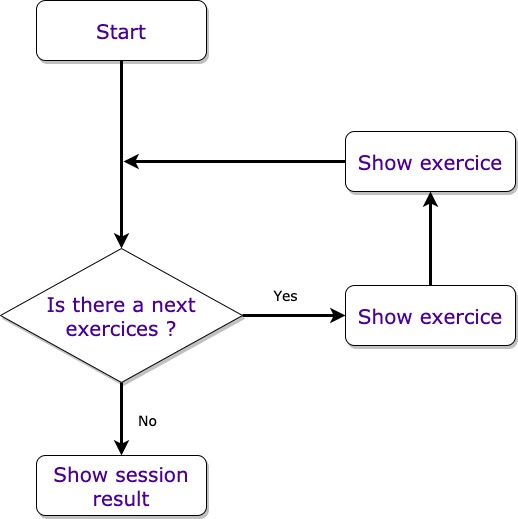

# Proteo Training App

## Story: Routing exercice application 

### Narrative #1

```
As a customer
I want to execute a set of exercices
So I can make my session
```

#### Senarios (Acceptance criteria)

```
Given the customer has a valid session
 When the customer select the session
 Then the app should start its session

Given the customer has an invalid session
 When the customer select the session
 Then the app should display an error message
```

## Use cases

### Route Exercice Use Case

#### Data (Input):

### Primary course (happy path):
1. Execute "Load Session" command with above data.
2. System downloads data from the URL.
3. System validates downloaded data.
4. System creates exercices items from valid data.
5. System delivers exercices items.

#### Invalid data - error course (sad path):
1. System delivers error.

#### No connectivity - error course (sad path):
1. System delivers error.

## Flowchart


## Architecture
#### Not created yet

## Model Specs

### Exercice

| Property	             | Type                 |
|----------------------------|----------------------|
| `name`	             | `String `            |
| `description`	             | `String `            |
| `numberRepetitions`        | `Int`                |
| `restTimeRepetion`         | `Int`                |
| `restTimeNextExercice`     | `Int` (optional)     |
| `repetitions`              | `[Int]`              |
| `rhythm`                   | `String` (optional)  |


### Payload contract

```
Get *url*

200 RESPONSE

{
 "exercices": [
            {
                "name": "a name",
                "description": "a description",
                "numberRepetitions": 4,
                "restTimeRepetition": 25,
                "restTimeNextExercice": 180,
                "repetitions": [7,7,7,7],
                "rhythm": "Fast"
            }
    ]
}
